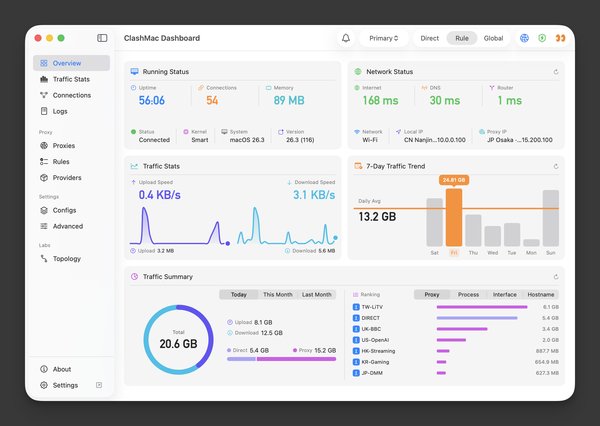
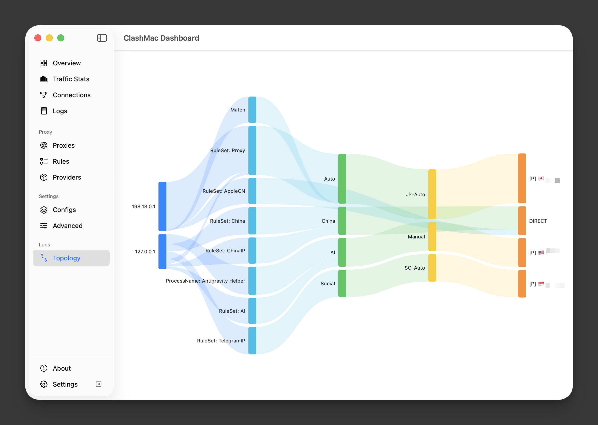

<div align="center">

[English](README.md) | [简体中文](README.zh-CN.md)

</div>


<p align="center">
  
</p>
<h1 align="center">ClashMac</h1>
<h3 align="center" style="margin-top: 0; margin-bottom: 10px;">为 macOS 打造的原生代理体验</h3>
<p align="center">
  🌐 <a href="https://clashmac.app"><strong>官方网站：clashmac.app</strong></a>
</p>

<p align="center" style="margin-top: 0; margin-bottom: 20px;">
  <a href="https://github.com/666OS/ClashMac/releases/latest">
    
  </a>
  <a href="https://github.com/666OS/ClashMac/releases">
    
  </a>
  <a href="https://clashmac.app">
    
  </a>
  <a href="https://t.me/Pinched666">
    
  </a>
</p>


<table>
  <tr>
    <td colspan="2" align="center"></td>
  </tr>
  <tr>
    <td colspan="2" align="center"></td>
  </tr>
  <tr>
    <td></td>
    <td></td>
  </tr>
</table>

## 核心体验

- **原生构建**：SwiftUI + macOS 原生 API，与系统深度集成
- **双模代理**：系统代理 + TUN 增强，全局接管无死角
- **独立面板**：原生 Dashboard，代理/规则/连接/日志一目了然
- **连接拓扑图**：自研全原生流量拓扑图，一眼看清数据从哪来、走哪去
- **追踪流量**：按代理/进程/接口/主机四维度统计，精准到字节
- **流量趋势**：7 天柱状图 + 日均对比，用量规律一目了然
- **规则统计**：规则匹配次数可视化，一键重置计数
- **安心截图**：一键隐藏 IP/节点等敏感信息，分享无顾虑
- **一键加规则**：为当前网页添加代理，适配主流浏览器
- **开箱即用**：DNS/TUN/GEO 等参数自动补全，零配置上手
- **实时掌控**：菜单栏显示网速、连接数、内存占用
- **流量可视**：订阅用量、到期时间、进度条一目了然
- **快速切换**：菜单栏/面板直接切换节点，延迟测速一键完成
- **自动断开连接**：切换节点后自动断开现有连接，流量立即走新节点
- **订阅管理**：远程配置导入、自动更新、智能命名
- **导入即用**：拖入 YAML 配置，自动切换生效
- **配置预检**：导入前自动验证，错误精准定位
- **加速视频**：禁用海外 QUIC，告别 YouTube 缓冲
- **参数覆写**：统一配置多订阅，不改原文件
- **崩溃诊断**：自动识别异常原因，给出解决建议
- **全局快捷键**：系统级快捷键控制代理，面板唤起一键触达
- **轻量运行**：菜单栏常驻，内存占用极低
- **界面定制**：菜单项按需显隐，打造专属界面
- **自动更新**：检测新版本，一键升级
- **中英双语**：跟随系统语言自动切换
- **告别密码弹窗**：特权助手接管，操作全程免密

## 系统要求

**最低版本**：macOS 13.5+

> **macOS 12.x 用户**：请继续使用 [v1.4.24](https://github.com/666OS/ClashMac/releases/tag/v1.4.24)，功能稳定可靠

## 下载

在 [Releases 页面](https://github.com/666OS/ClashMac/releases/latest) 下载最新版本：

- **Apple Silicon (M1/M2/M3/M4/M5)**: `ClashMac-*-macos-arm64.zip`
- **Intel Mac**: `ClashMac-*-macos-x86_64.zip`

**兼容方案**：请参阅 [测试配置](https://github.com/666OS/YYDS/tree/main/mihomo/config)

**安装步骤**：
1. 解压下载的 zip 文件
2. 将 `ClashMac.app` 拖到"应用程序"文件夹
3. 首次打开时，右键点击并选择"打开"（绕过安全检查）

**提示**: 不确定您的 Mac 类型？点击左上角  → 关于本机，查看"芯片"信息。

> **注意：Mac Gatekeeper 可能会拦截未签名应用**

### 解决方法

#### 方法 1：系统设置中允许打开
1. 尝试打开 ClashMac，出现安全警告时点击"完成"
2. 打开 **系统设置** → **隐私与安全性**
3. 向下滚动，找到提示："ClashMac 已被阻止打开"
4. 点击旁边的"仍要打开"
5. 在弹出框再点击"仍要打开"即可

#### 方法 2：终端解除限制
在"终端"中输入：

```bash
xattr -cr /Applications/ClashMac.app
```
回车后重新打开应用


#### 方法 3：移除隔离属性

在"终端"中输入：
```bash
xattr -d com.apple.quarantine /Applications/ClashMac.app
```
回车后重新打开应用

## 安全设计

**特权助手安全加固**：修复潜在的命令注入漏洞

- **白名单路径验证**：仅允许 `/Applications/ClashMac.app/` 内的内核执行
- **权限收紧**：限制为管理员用户访问
- **POC 验证**：`/bin/sh`、路径穿越等攻击均被拦截

> *"安全是一个过程，而非产品。"* — Bruce Schneier

## 安全与隐私

本应用完全在 macOS 本地运行，不收集或上传任何用户数据。

网络访问仅在用户显式配置，或用户手动检查更新时发生（更新文件托管于 GitHub）。

应用仅请求其功能所需的最小系统权限。

## 许可证

ClashMac 是一个专有的闭源应用程序。  
本仓库仅提供二进制发布版本。

本项目使用了第三方开源组件。  
完整的许可证列表可在此处查看：

[第三方许可证](https://github.com/666OS/ClashMac/blob/main/THIRD_PARTY_LICENSES.txt) 

## 致谢

- [mihomo](https://github.com/MetaCubeX/mihomo)
- [Vernesong](https://github.com/vernesong/mihomo)
- [Zashboard](https://github.com/Zephyruso/zashboard)

## Star History
[](https://star-history.com/#666OS/ClashMac&Date)

---

<p align="center">
  为 macOS 用心打造 ❤️
</p>
